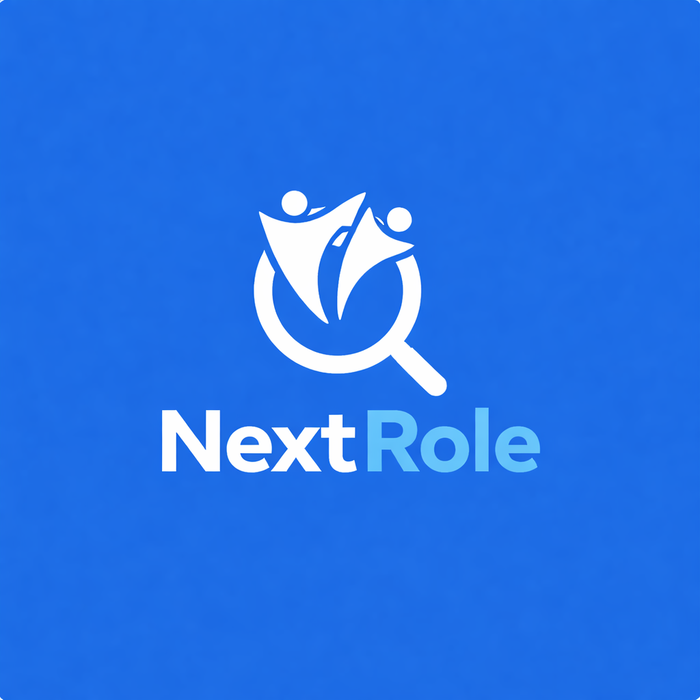
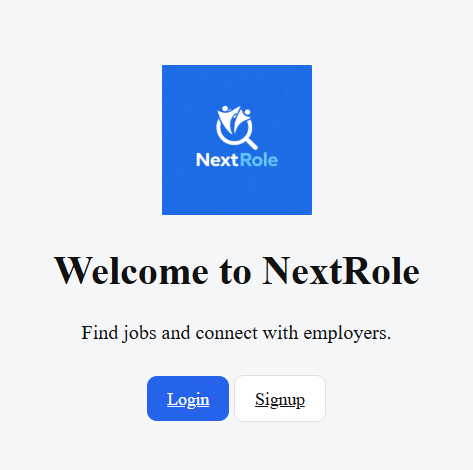

# NextRole – Job Portal Web Application

🚀 Live Demo: https://evertrust-digital-studio-tau.vercel.app




A modern full-stack job portal application that enables job seekers to search and apply for jobs, while employers can post job openings and manage applicants efficiently.

NextRole demonstrates a **real-world recruitment workflow** including authentication, job listings, applicant management, and employer dashboards.

---

## Live Demo

🔗 **Live Website**  
https://amulyabashetty-source.github.io/nextrole-job-portal/

💻 **Source Code**  
https://github.com/amulyabashetty-source/nextrole-job-portal

---

## Screenshot

### Landing Page



---

# Features

## Job Seeker

- User signup and login
- Profile creation with skills, experience, and resume link
- Search jobs with filters (location, job type, experience)
- Apply to jobs
- Save jobs for later
- View application status
- Dashboard showing profile completion

## Employer

- Employer account and profile
- Post new jobs
- Edit or close jobs
- View applicants for each job
- Accept or reject candidates
- Dashboard showing total jobs and applicants

## Platform Features

- Role-based authentication (Job Seeker / Employer)
- Secure login using Firebase Authentication
- Real-time database using Firebase Firestore
- Email notifications when candidates apply
- Profile image upload using Cloudinary
- Responsive navigation bar with job search
- Dark and light theme support

---

# Tech Stack

## Frontend

- HTML
- CSS
- JavaScript (ES Modules)

## Backend & Services

- Firebase Authentication
- Firebase Firestore Database
- EmailJS (Email notifications)
- Cloudinary (Image storage)

---
## Project Structure

```
NextRole/
│
├── index.html
│
├── pages/
│   ├── employer/
│   │   ├── employer-dashboard.html
│   │   ├── add-job.html
│   │   ├── posted-jobs.html
│   │   └── applications.html
│   │
│   └── jobseeker/
│       ├── jobseeker-dashboard.html
│       ├── jobs.html
│       ├── job-details.html
│       ├── my-applications.html
│       └── saved-jobs.html
│
├── js/
│   ├── core/
│   │   ├── firebase.js
│   │   ├── navbar.js
│   │   ├── theme.js
│   │   └── search.js
│   │
│   ├── auth/
│   │   ├── login.js
│   │   └── signup.js
│   │
│   ├── employer/
│   │   ├── employer-dashboard.js
│   │   ├── add-job.js
│   │   ├── posted-jobs.js
│   │   └── applications.js
│   │
│   └── jobseeker/
│       ├── jobseeker-dashboard.js
│       ├── jobs.js
│       ├── job-details.js
│       ├── my-applications.js
│       └── saved-jobs.js
│
├── css/
│   ├── style.css
│   ├── jobs.css
│   ├── job-details.css
│   ├── profile.css
│   └── settings.css
│
├── assets/
│   └── images/
│       ├── logo.png
│       └── nextrole_image.png
│
└── README.md
```


## How to Run the Project

### 1 Clone the repository

git clone https://github.com/amulyabashetty-source/nextrole-job-portal.git

### 2 Open the project folder

cd nextrole-job-portal

### 3 Run the project

You can run the project using:

- VS Code Live Server extension
- Or simply open `index.html` in your browser

### 4 Configure Firebase

Add your Firebase configuration inside:

js/core/firebase.js


---

## Key Functionalities

- Secure authentication using Firebase Authentication
- Role-based dashboards for employers and job seekers
- Job posting and management system
- Applicant tracking system
- Email notifications when candidates apply
- Modular JavaScript architecture
- Integration with third-party services

---

## Future Improvements

- Resume upload feature
- Admin moderation panel
- Advanced job recommendation system
- Pagination for job listings
- Messaging system between employers and candidates

---

## Why This Project

This project demonstrates hands-on experience in building a scalable full-stack web application using modern JavaScript and cloud-based services.

Key concepts implemented:

- Authentication and role-based access control
- Cloud database integration using Firestore
- Modular JavaScript architecture
- Real-world recruitment workflow
- Integration with external APIs and services

---

## Author

**Amulya Bashetty**

Electronics and Communication Engineering Graduate (2025)  
Aspiring Full-Stack Developer

---

## License

This project is created for **educational and portfolio purposes**.
